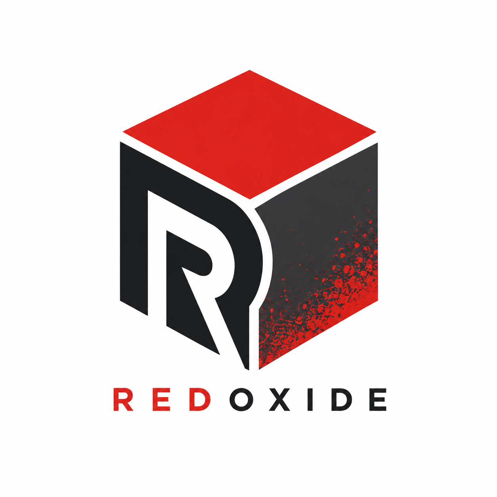

<p align="center">
  
</p>

# redoxide


A lightweight Minecraft reverse proxy written in Rust that starts your server on demand when a player connects, and shuts it down automatically when everyone leaves.

Built as a replacement for [Infrared v1](https://github.com/haveachin/infrared) with two key improvements:

- **No manual retry** — the player's connection is held open while the server boots. They wait on the "Logging in..." screen and join seamlessly once it's ready.
- **Ping never wakes the server** — only an actual login attempt starts the container. Server list refreshes don't trigger a boot.

## How it works

```
Player pings server list  →  redoxide responds with MOTD  →  container stays stopped
Player clicks Join        →  redoxide starts container    →  sends Login Plugin Request keepalives every 10s
                                                             (prevents client timeout while server boots)
                          →  server ready               →  connection forwarded transparently
Player disconnects        →  idle timer starts           →  container stopped after N minutes
```

Server state is shared across all concurrent connections via a `tokio::sync::watch` channel — if two players connect simultaneously, only one `docker start` is issued and both wait on the same boot sequence.

## Requirements

- Docker (with socket access at `/var/run/docker.sock`)
- The Minecraft container must exist in a stopped state — create it without starting: `docker compose up --no-start minecraft`
- Minecraft 1.13+ (uses Login Plugin Request packets as keepalives; non-issue for any modern server)

## Configuration

Copy `config.example.toml` to `config.toml` and edit:

```toml
[proxy]
bind = "0.0.0.0:25565"
server_address = "your.domain.com"   # must match exactly what clients send in the handshake

[target]
host = "minecraft"                   # Docker service hostname
port = 25565

[docker]
container_name = "minecraft-minecraft-1"
startup_timeout_secs = 120           # disconnect client if server doesn't boot within this time
idle_shutdown_secs = 600             # stop container N seconds after last player leaves

[status]
# protocol_version and version_name are auto-detected by probing the real server
# and cached in .redoxide-version-cache.json — these are only used as a last
# resort if the cache is empty (i.e. the server has never been started yet).
protocol_version = 0
max_players = 20
online_motd = "§c🎉 §9§lMy Server§c! 🎉"
version_name = "unknown"
# Optional: read max_players and online_motd directly from server.properties
# server_properties = "/server.properties"
```

### Reading from server.properties

If `server_properties` is set, redoxide reads `max-players` and `motd` from that file at startup, overriding the values in config.toml. Mount the file into the container:

```yaml
volumes:
  - ./server.properties:/server.properties:ro
```

## Docker Compose

```yaml
services:
  minecraft:
    restart: "no"           # redoxide manages the lifecycle — don't auto-restart
    image: eclipse-temurin:25-jre-jammy
    volumes:
      - ./:/minecraft
    working_dir: /minecraft
    command: sh start.sh
    networks:
      - homelab_network

  redoxide:
    image: ghcr.io/samuelloranger/redoxide:latest
    container_name: redoxide
    restart: unless-stopped
    ports:
      - "25565:25565"
    volumes:
      - ./config.toml:/config.toml:ro
      - ./server.properties:/server.properties:ro
      - redoxide-cache:/var/cache/redoxide
      - /var/run/docker.sock:/var/run/docker.sock
    networks:
      - homelab_network

volumes:
  redoxide-cache:

networks:
  homelab_network:
    external: true
```

Then create the Minecraft container without starting it:

```bash
docker compose up --no-start minecraft
docker compose up -d redoxide
```

## Environment

| Variable | Default | Description |
|---|---|---|
| `RUST_LOG` | `redoxide=info` | Log level (`trace`, `debug`, `info`, `warn`, `error`) |

## Graceful shutdown (RCON)

By default redoxide stops the container with `docker stop`. If you configure RCON, it sends a `/stop` command to the server first, waits for it to shut down cleanly (saving chunks and player data), and only force-stops if the server doesn't exit within 30 seconds.

If `server_properties` is mounted and `enable-rcon=true` is set in it, RCON is configured automatically — no extra config needed.

To configure manually:

```toml
[rcon]
host = "minecraft"
port = 25575
password = "your-rcon-password"
```

## External start/stop detection

redoxide polls the container state every 15 seconds. If the container is stopped externally (e.g. `docker stop minecraft`) it updates its internal state immediately so the server list reflects reality. If the container is started externally it detects that too and probes the version.

## Protocol version auto-detection

redoxide automatically detects the server's protocol version and version name by pinging it directly after it starts. The detected values are cached in `.redoxide-version-cache.json` and reloaded on startup — so even when the server is stopped, the server list shows the correct version from last time.

The cache is stored at `/var/cache/redoxide/version.json` inside the container. Persist it across restarts using a named Docker volume — no manual setup required:

```yaml
volumes:
  redoxide-cache:/var/cache/redoxide
```

The `protocol_version` and `version_name` fields in config are a last-resort fallback used only if the cache is empty and the server has never been started. They can be set to any value — or left as the defaults — since they'll be overwritten on first boot.

## Building from source

```bash
cargo build --release
# Binary at target/release/redoxide
```

Requires Rust 1.75+.

## Docker image

Pre-built images (`linux/amd64`) are published to GitHub Container Registry on every version tag:

```
ghcr.io/samuelloranger/redoxide:latest
ghcr.io/samuelloranger/redoxide:v0.1.1
ghcr.io/samuelloranger/redoxide:0.1
```

## License

MIT
